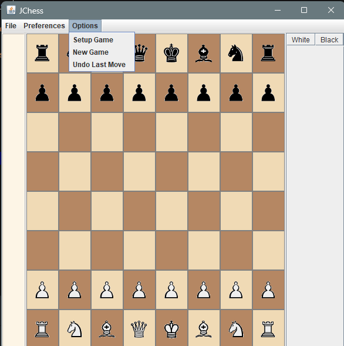

# GUI-Based Java Project

## 📋 Project Overview       
To build a two-player GUI-based Chess game in Java, focusing on game rules, move validation, and an interactive interface. The project helps improve skills in object-oriented programming and GUI development.

---

## 📌 Features
- 🧠 Smart move validation and check/checkmate detection
- 🎨 Customizable GUI using Java Swing
- 🧑‍🤝‍🧑 Local 2-player mode
- ♟️ Accurate piece movement rules
- 💾 Save/load game (if implemented)
- 🧰 Full Chess rule enforcement
- ☕ Interactive GUI using Java Swing
- 💡 Special moves: castling, en passant, promotion
- ☑️ Check and checkmate detection


## 📸 Screenshots
<p align="center">
  
  
  <br>
  
  
</p>


### 👨‍💻 Contributors

- [**Abhishek Pandey**](https://github.com/abhishekdpandey18) – Project Author & Documentation Writer
- [**Abhyudaya Singh**](https://github.com/abhyudayasingh18) – Game Logic Developer
- [**Edmund Emmanuel Magori**](https://github.com/kyliz) – UI/UX Designer
- [**Abdulrahman Abdulnasir Hamza**](https://github.com/raman-ah) – GUI Developer

***

## ✅ 1. 🛠️ Development Setup 

### ✅ JDK Version         
- **JDK Version**: `Java SE Development Kit 17`
- Make sure JDK 17 is installed and configured in your environment.
- [Download JDK](https://www.oracle.com/java/technologies/javase-downloads.html)

### ✅ IDE Used
- **IDE**: `IntelliJ IDEA Community Edition 2023`
- You may also use `Eclipse` or `VS Code` with Java extensions.
   
---

## ✅ 2. ✨ Project Structure      
- The project Structure in already given in a text file `CheckMate ## Project Structure.txt`

---

## ✅ 3. 🗃️ Database Schema Design 
The project uses a MySQL database to store chess game details and move history.

---
 
## ✅ 4. 📂 MySQL Tables   

- **Game**  
  Stores the overall game information like player names, winner, and timestamps.

- **MoveHistory**  
  Stores each move made in a game, including notation, origin/destination squares, and timestamps.
  
- SQL Schema File

The database schema is defined in [`schema.sql`](schema.sql), which includes:
 

```sql
CREATE TABLE Game (...);
CREATE TABLE MoveHistory (...);
```

---

 
## ✅ 5. 🌸 JDBC Implementation 

We've successfully implemented JDBC to enable interaction between our Java Chess game and a MySQL database.

- A dedicated `DatabaseConnection.java` class was created to handle the database connection logic.
- JDBC is used to connect the Java application to a MySQL database (`chessdb`).
- This connection will support storing and retrieving move history or other game-related data in future extensions.

### 📄 `DatabaseConnection.java` Highlights

```java
package com.chess.database;

import java.sql.Connection;
import java.sql.DriverManager;
import java.sql.SQLException;

public class DatabaseConnection {
    private static final String URL = "jdbc:mysql://localhost:3306/chessdb";
    private static final String USER = "root";
    private static final String PASSWORD = "yourpassword";

    public static Connection getConnection() throws SQLException {
        return DriverManager.getConnection(URL, USER, PASSWORD);
    }
}
```

---


## ✅ 6. 🎀 Create Model & DAO 
To manage database interactions cleanly and efficiently, we implemented:

🧩 MoveRecord.java (Model)
- This class represents a single record of a chess move. It includes:
- moveNumber – The sequential number of the move.
- whiteMove – Move made by the White player.
- blackMove – Move made by the Black player. 

---

## ✅ 7. 🎨 Aesthetics and UI Design 
- We enhanced the user interface of the Java Chess game to improve usability and visual appeal by:
- Using custom fonts for a cleaner and more modern look.
- Optimizing layouts with appropriate spacing and component alignment.
- Adding colors to differentiate player moves and highlight game states (e.g., check, checkmate).
- Incorporating icons and images for chess pieces and game status indicators.
- Ensuring the UI adapts well to different window sizes for better responsiveness.
-These improvements help create a more engaging and intuitive gameplay experience.

---

## ✅ 8. 🥇Component Placement
- The game GUI components are thoughtfully arranged to ensure clarity and usability:
- All panels and elements (chessboard, move history, taken pieces) are properly aligned using layout managers.
- Consistent spacing and sizing maintain a balanced and clean interface.
- Scroll panes and tables resize gracefully, keeping the move history accessible and readable.
- No major redesign was needed since the existing layout was already well-structured and user-friendly.

---

## ✅ 9. ⌨️ Responsiveness & Accessibility
- To enhance user experience, we incorporated:
- Keyboard shortcuts for common actions (e.g., undo move, restart game) to speed up gameplay.
- Tooltips on buttons and interactive components to guide users intuitively.
- A scalable layout that adjusts gracefully to different window sizes (optional but encouraged).
- These improvements make the game more accessible and user-friendly for a wider audience.

---

## ✅10. ⌨️ Play! Enjoy Guys
- ♟️ Why did the chess player bring a ladder to the game?
Because they heard the king was in a high position! 😄
- ♟️ Why don’t chess players ever get locked out of their houses?
Because they always have a key square! 😄
